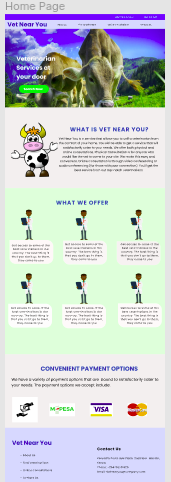
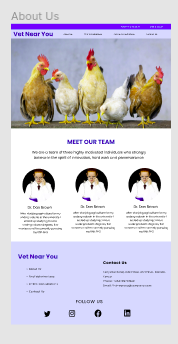
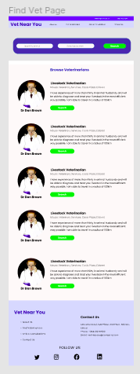
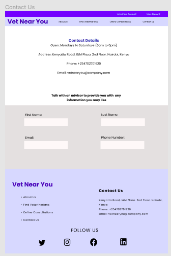
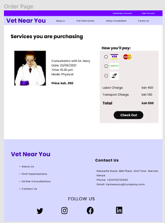
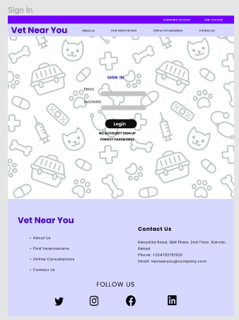
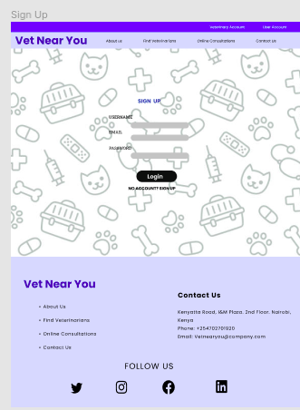
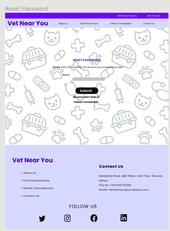

## Veterinarian Website

This is a site to connect farmers with veterinarians, 04/08/2021

By Khajira Christopher, Larvine Asande, Elizabeth Gikonyo, Nancy Mwende

## Description

The purpose of the veterinarian website is to connect farmers with veterinarian. The site contains eight pages; the home page, about us page, find veterinarian page, online consultations page, login page, the contact us page and the order page.
The home page has the navigation bar with a logo and the links to other pages. The home page has sections such as "What is Vet Near You", "What we offer" and "Convenient Payment Options". 

The about us page contains the navigation bar and the footer just like the home page. Between these two elements, it contains the "Meet Our Team" section.

The Find-Vet page contains information of the doctors who are available for work

The login, sign up and sign in pages are used for authentication.

The order page is the final page that shows the order summary of the user

## Setup/Installation Requirements
1. Clone the project using git -clone . If you are not able to clone it, you can download the files as a zip folder

2. Ensure that you have the complete file

3. Navigate to the index.html file which is in the root file of the folder. The application is static and only uses HTML and CSS 

4. Copy the path of the index.html file to your browser and you will be able to access the application.

## Technologies Used
This project uses HTML and CSS.
## Support and contact details
If you have any issues or questions, you can get intouch with me through email: christopher.khajira@student.moringaschool.com. Please feel free to make any contributions to the code.

## Design Diagrams
Home Page

About Page

Find-vet Page

Contact Page

Order Page

Login Page

Sign Up Page

Reset Page

### License
MIT License
Copyright (c) 2021 Khajira Christopher, Larvine Asande, Elizabeth Gikonyo, Nancy Mwende
